# Bitcoin Predictive Forecast

A research-oriented forecasting system for Bitcoin prices that integrates classical time series models, machine learning techniques, and hybrid modeling approaches.

---

## 1. Overview

This project presents a complete pipeline for Bitcoin price forecasting, covering data ingestion, preprocessing, modeling, evaluation, and visualization.

The system supports:
- Data upload in CSV and Excel formats  
- Automated detection of temporal and price-related columns  
- Exploratory data analysis and visualization  
- Model selection across statistical and machine learning approaches  
- Forecast generation with confidence intervals  
- Backtesting and performance evaluation  

---

## 2. Dataset Analysis

### 2.1 Data Visualization

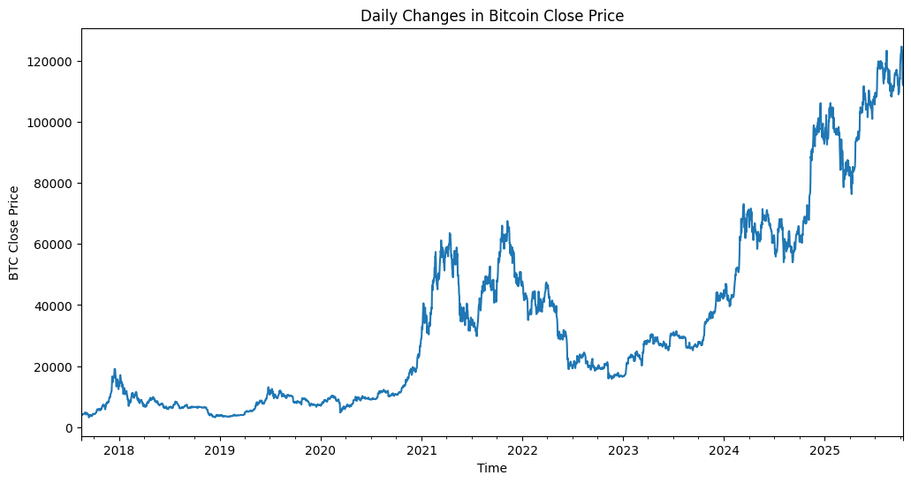

### 2.2 Observations

Analysis of daily Bitcoin closing prices reveals the following:

- A consistent upward trend over the past five years  
- Increasing volatility over time  
  - 2018–2020: relatively stable fluctuations  
  - 2024–2025: significantly larger price movements  
- Presence of heteroscedasticity (non-constant variance)  
- Absence of strong seasonal patterns  
- Significant market shifts (e.g., 2021, late 2024) likely driven by macroeconomic factors  

These observations motivate decomposition into trend, seasonal, and residual components.

---

## 3. Machine Learning Experiments

### 3.1 Feature Engineering

A set of temporal and statistical features was constructed to enhance predictive performance:

```
day_of_week, month, day_of_year, is_weekend,
lag_1, lag_3, lag_7,
rolling_mean_7, rolling_std_7,
rolling_mean_14, rolling_std_14,
rolling_mean_30, rolling_std_30,
day_of_week_sin, day_of_week_cos,
month_sin, month_cos
```

---

### 3.2 Tree-Based Models

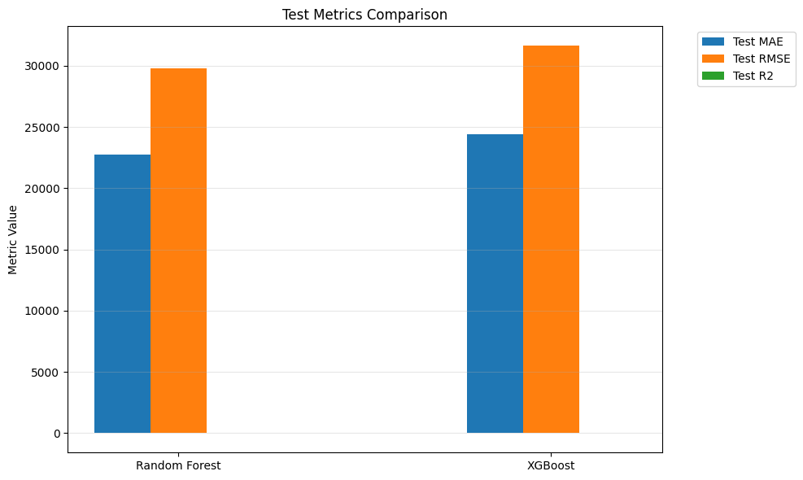

#### Findings

- Strong performance on training data (e.g., low MAE)  
- Significant degradation on test data  
  - MAE exceeding 22,000  
  - RMSE approaching 30,000  

#### Interpretation

Tree-based models such as Random Forest and XGBoost demonstrate overfitting behavior.  
They effectively interpolate within the training distribution but fail to extrapolate in highly volatile financial time series.

---

### 3.3 Trend Modeling with GAM

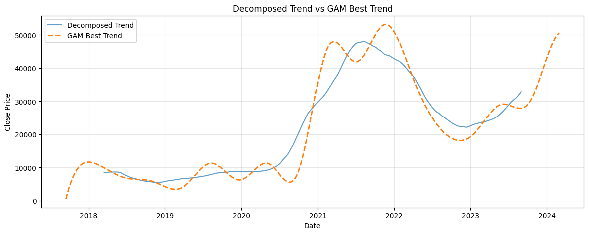 
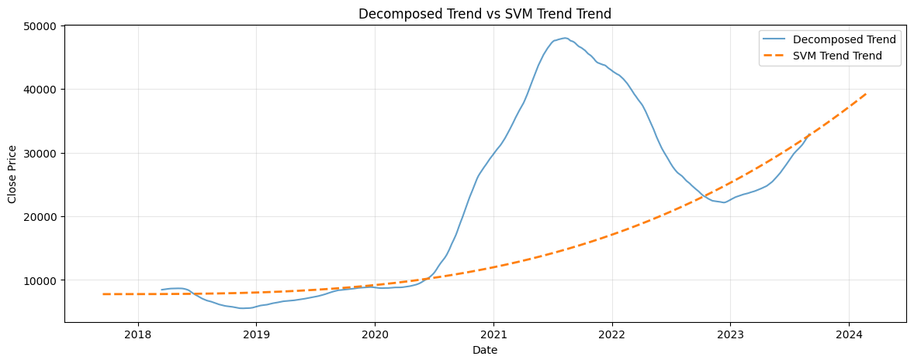

Generalized Additive Models (GAM) were used to isolate and remove the trend component prior to training machine learning models.

---

### 3.4 Hybrid Modeling Approach (GAM + XGBoost)

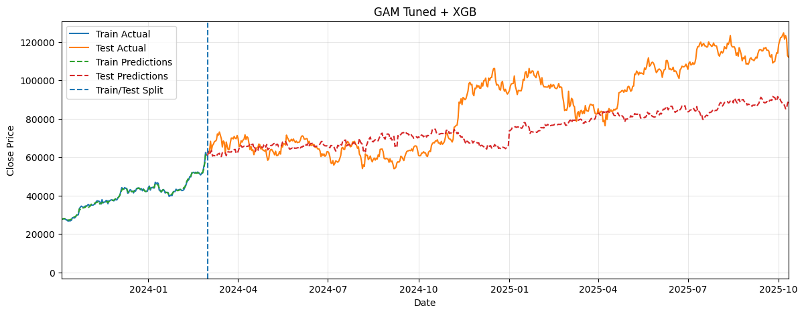

| Model                    | Train MAE | Test MAE    | Train RMSE | Test RMSE   | Train R2 | Test R2  | Train MAPE | Test MAPE |
|--------------------------|----------:|------------:|-----------:|------------:|---------:|---------:|-----------:|----------:|
| SVM + XGB               | 380.97    | 15320.77    | 540.57     | 19175.72    | 0.9989   | 0.1358   | 0.0241     | 0.2205    |
| Linear Regression + XGB | 553.28    | 18093.26    | 814.06     | 20404.60    | 0.9975   | 0.0215   | 0.0411     | 0.2063    |
| GAM Basic + XGB         | 338.88    | 32659.76    | 483.37     | 36696.26    | 0.9991   | -2.1647  | 0.0207     | 0.3847    |
| GAM Tuned + XGB         | 391.93    | 14880.91    | 544.08     | 18619.99    | 0.9989   | 0.1852   | 0.0267     | 0.1572    |

The hybrid model separates trend modeling (GAM) from residual learning (XGBoost), leading to improved generalization compared to standalone machine learning models.

---

## 4. SARIMA Experiment

### 4.1 Stationarity Transformation

Differencing was applied iteratively on the log-transformed series until stationarity was achieved:

```python
for _ in range(2):
    series = series.dropna()
    is_stationary, _ = helpers.adf_test(series)

    if is_stationary:
        break

    series = series.diff()
    d += 1

```

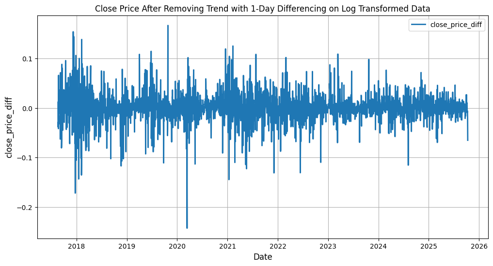

---

### 4.2 Model Selection

AutoARIMA was evaluated with multiple seasonal periods:

```python
m = 1, 7, 14, 30
```

All configurations converged to:

```
ARIMA(1,0,0)
```

Performance metrics remained consistent:

  * MAE = 0.010696
  * RMSE = 0.014553
  * MAPE ≈ 1%

**Interpretation:**

- No significant seasonal structure is present
- The model simplifies to an autoregressive process
- Only short-term dependencies are captured

---

### 4.3 Forecast Behavior

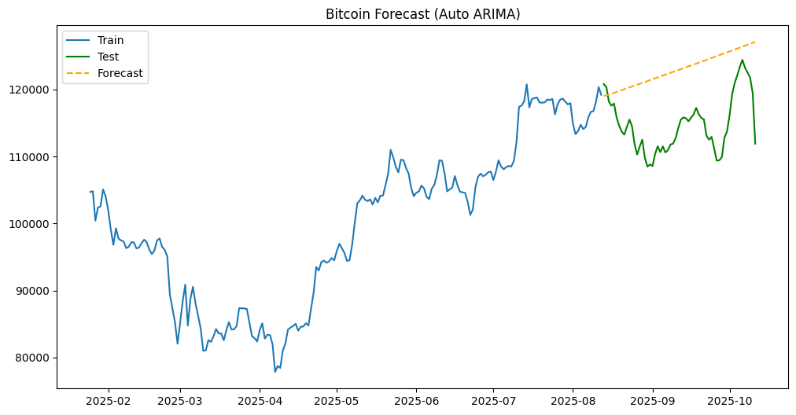

Observations:

- Overly smooth predictions
- Inability to capture volatility
- Mean-reverting behavior
- Underfitting of real market dynamics

---

## 5. Implemented Models

- Hybrid Model (GAM + XGBoost)
- Naive Baseline Model
- Prophet Model
- SARIMA Model

---

## 6. Experiment Branches

- `experiment/mlmodels`  
- `experiment/sarima`  

---

## 7. Supported Data Formats

- `.csv`  
- `.xlsx`  
- `.xls`  

---

## 8. Column Detection Strategy

### 8.1 Date Column Detection

The system automatically identifies the date column using a two-stage approach:

- **Name-based detection**:  
  Searches for common keywords such as `date`, `time`, and `timestamp`.

- **Fallback detection (data-driven)**:  
  If no column matches by name, the system evaluates all columns based on parsing success rate and uniqueness to select the most likely datetime column.

This dual approach ensures robustness across structured and unstructured datasets.

---

### 8.2 Price Column Validation

Supported financial price columns include:

- Open  
- High  
- Low  
- Close (OHLC format)

The selected column is validated using multiple statistical checks:

```python
valid_ratio = series.notnull().mean()
```

Ensures that the column contains a sufficient proportion of numeric values.

```python
if series.nunique() < 5:
```

Rejects columns that do not exhibit time-series behavior due to low variability.

```python
skewness = series.skew()
```

Identifies abnormal distributions, often associated with non-price data such as volume.

```python
ratio = series.max() / (series.median() + 1e-9)
```

Prevents extreme scaling inconsistencies that are not typical of price data.

```python
spike_ratio = (series.diff().abs() > series.std() * 5).mean()
```

Detects noisy or irregular signals that are unlikely to represent valid financial prices.

**These validation steps ensure that only meaningful financial signals are used for modeling.**

---

## 9. Data Processing Pipeline

The preprocessing stage includes:

- Handling missing values
- Ensuring proper datetime formatting
- Sorting data chronologically
- Resampling to a daily frequency ("D")

**This guarantees consistency and suitability for time series modeling.**

---

## 10. Log Transformation

Training directly on raw price values led to unstable model behavior, including unrealistic negative predictions.

To address this, a logarithmic transformation was applied:

- Stabilizes variance
- Improves numerical stability
- Enhances predictive performance

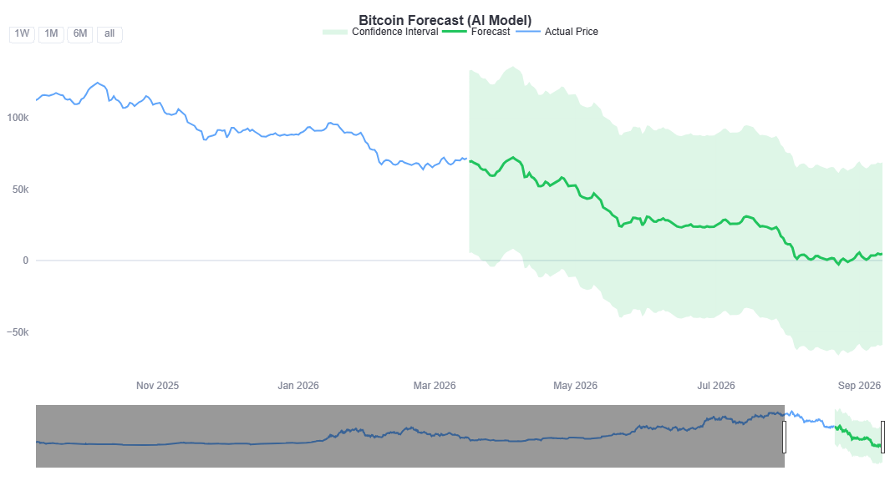
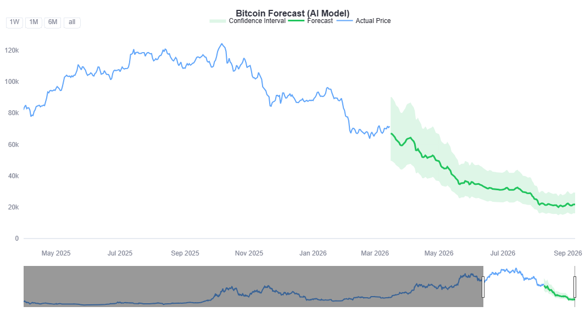

---

## 11. Application Workflow

The system follows a structured pipeline:

1. Upload dataset
2. Automatic column detection and validation
3. Data visualization
4. Model configuration:
  - Model selection
  - Forecast horizon
  - Confidence interval
  - Backtesting option
5. Forecast generation
6. Performance evaluation


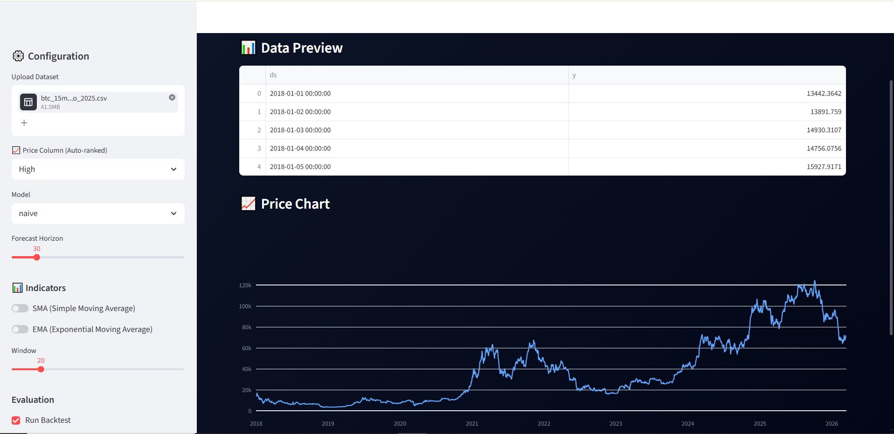

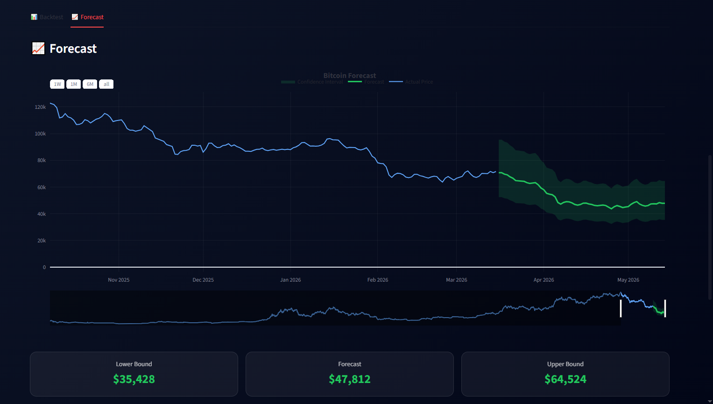

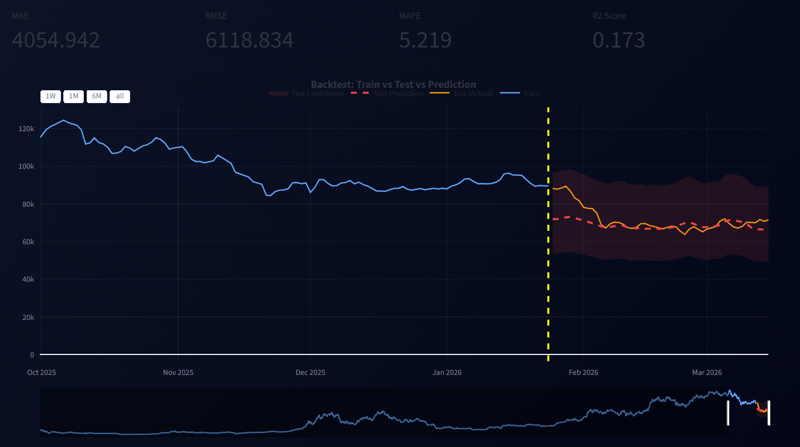

---

## 12. Project Structure

```
models/
│── BaseForecastModel.py
│── ForecastEngine.py
│── MLModel.py
│── NaiveModel.py
│── ProphetModel.py
│── SarimaModel.py

notebooks/
│── experiment.ipynb

app.py
helpers.py
utils.py
requirements.txt
```

---

## 13. Installation and Execution

#### 1. Clone the repository

```bash
git clone https://github.com/Aliha7ish/bitcoin_predictive_forecast.git
cd bitcoin_predictive_forecast
```

#### 2. Install dependencies

```bash
pip install -r requirements.txt
```

#### 3. Run the app

```bash
streamlit run app.py
```

---

## 14. Key Findings
- Bitcoin price series is non-stationary and highly volatile
- No strong seasonal patterns are observed
- Statistical models such as SARIMA tend to underfit
- Tree-based machine learning models tend to overfit
- Hybrid modeling provides a more balanced and effective solution

---

## 15. License

**MIT License**

---

## 16. Author

**Ali Mohamed Hashish**
